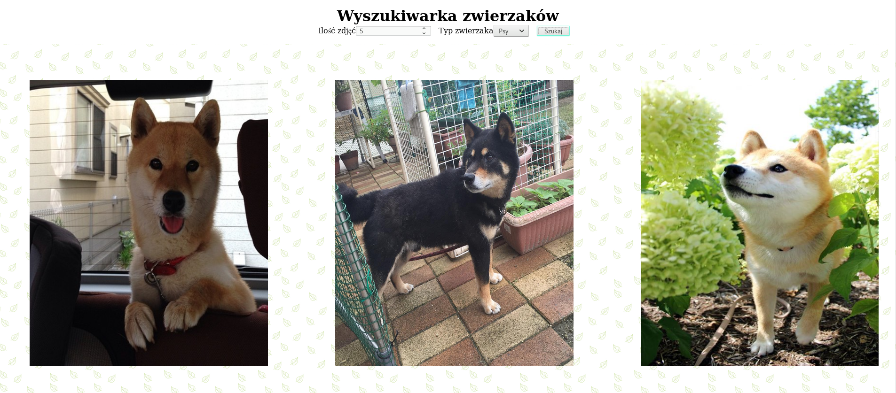

# Animal search application



To install this application:

```shell
$ npm install && npm run build
```

You can also run this application via i.e. _http-server_ package

```shell
$ npm install http-server -g
```

After installing you can simply type

```shell
$ http-server
```

inside the project directory to host it to your localhost

This application has been made as a task for [React Native Has Power workshops](https://www.facebook.com/events/535030196973372/)
